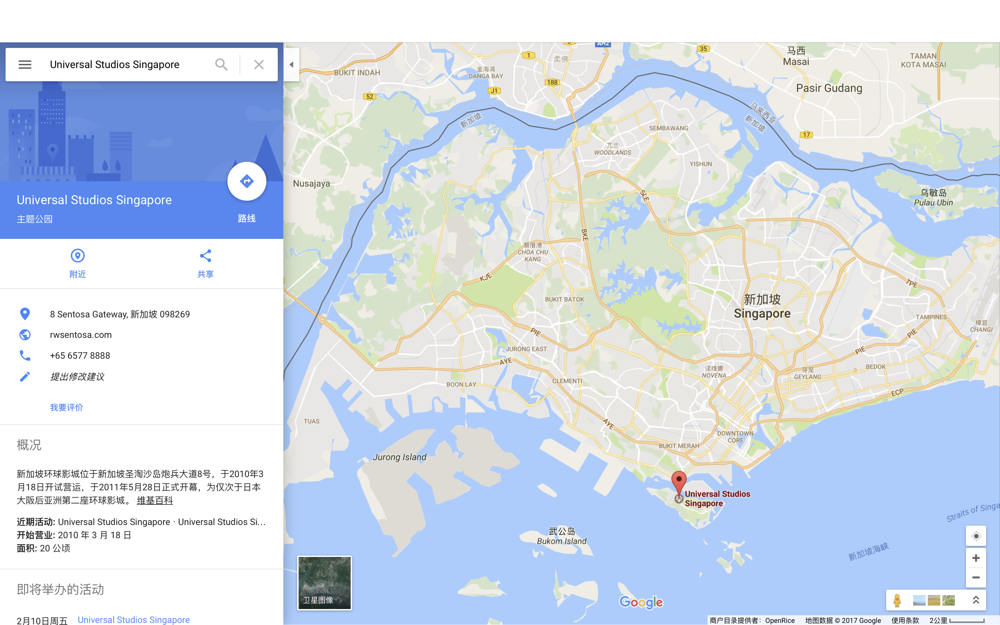
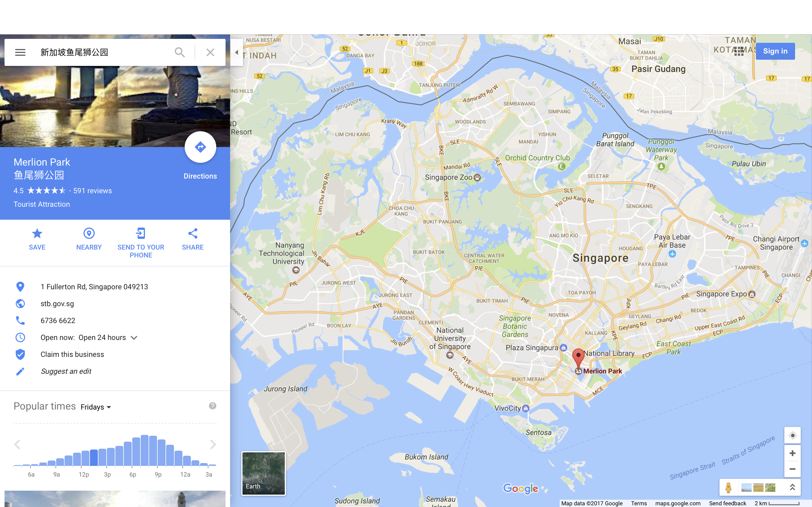
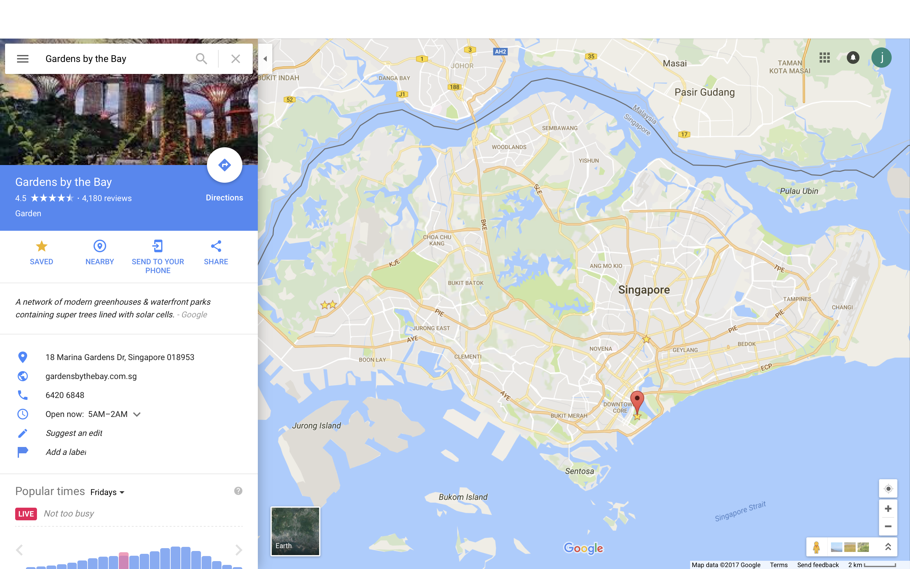
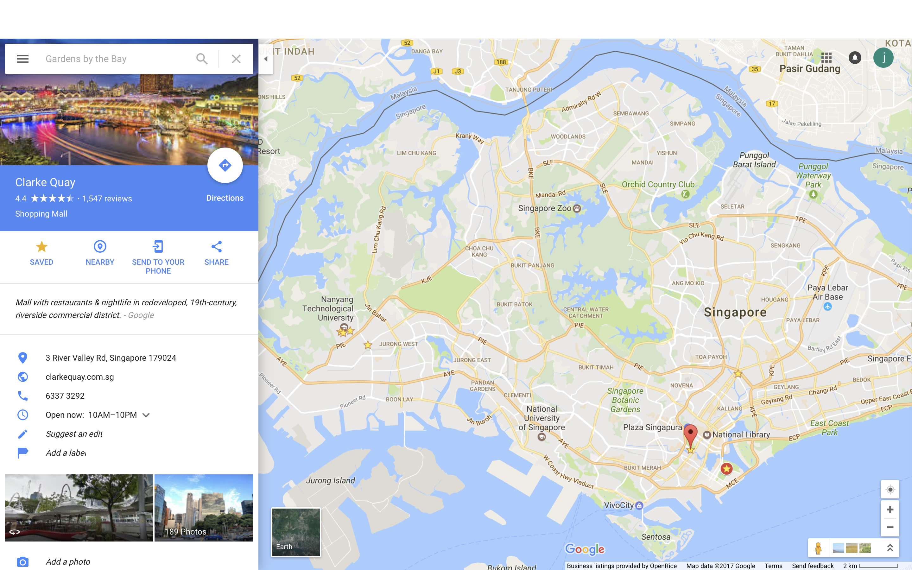
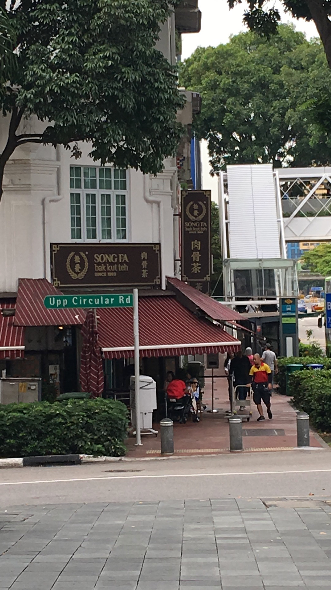
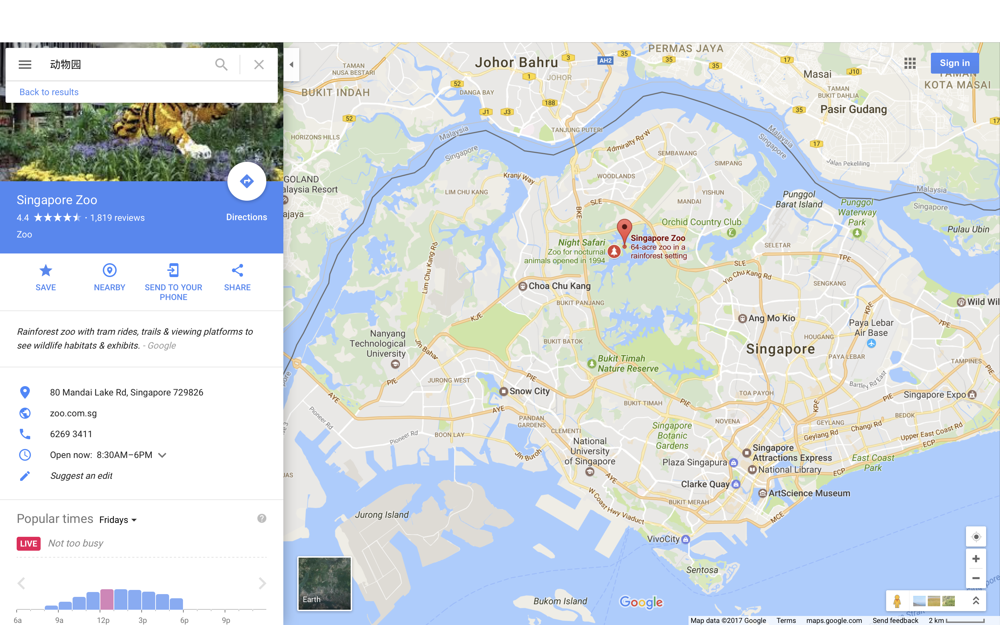
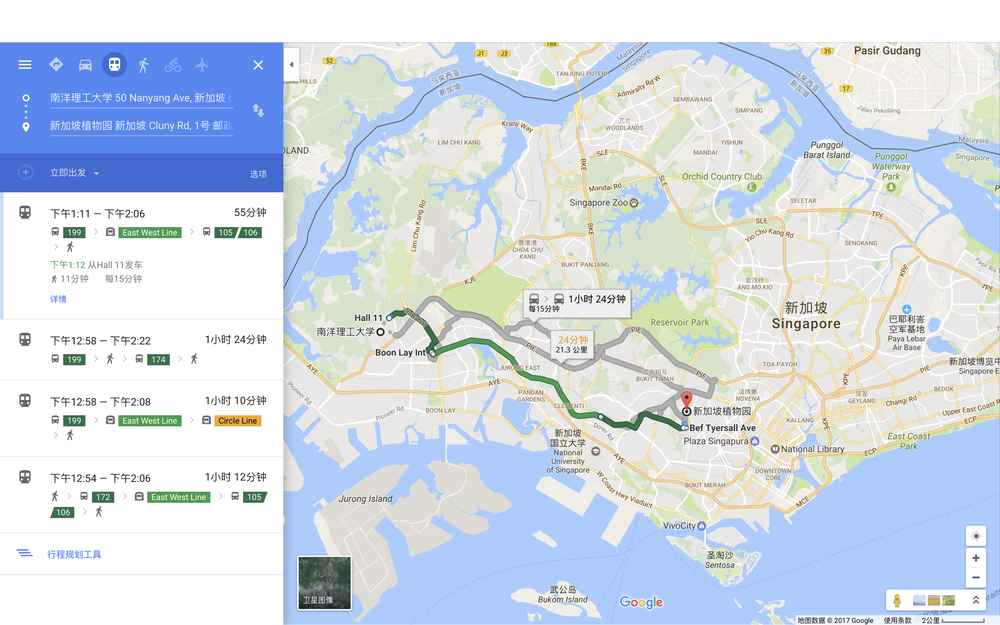
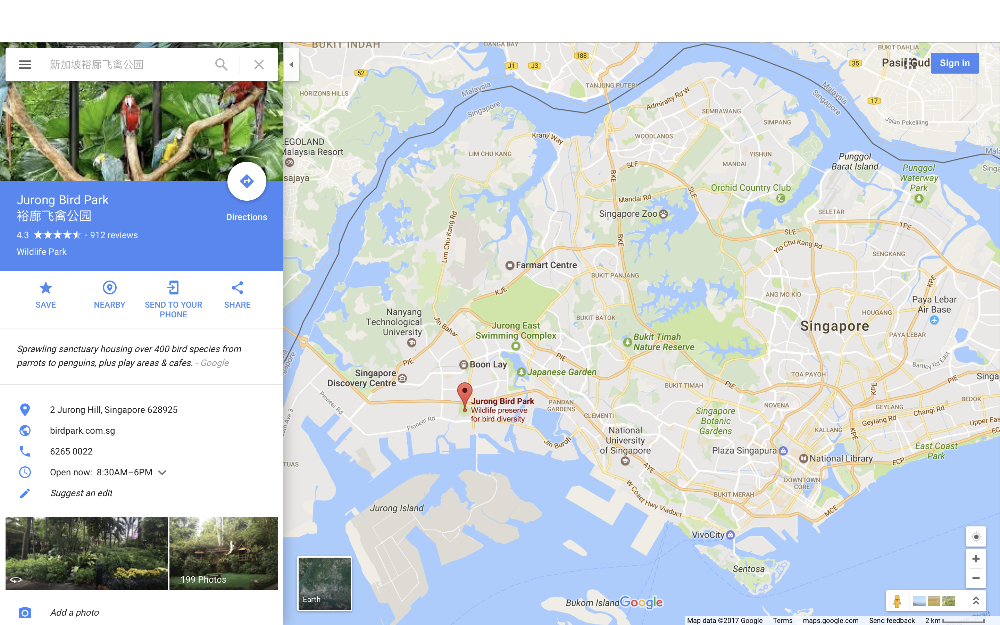
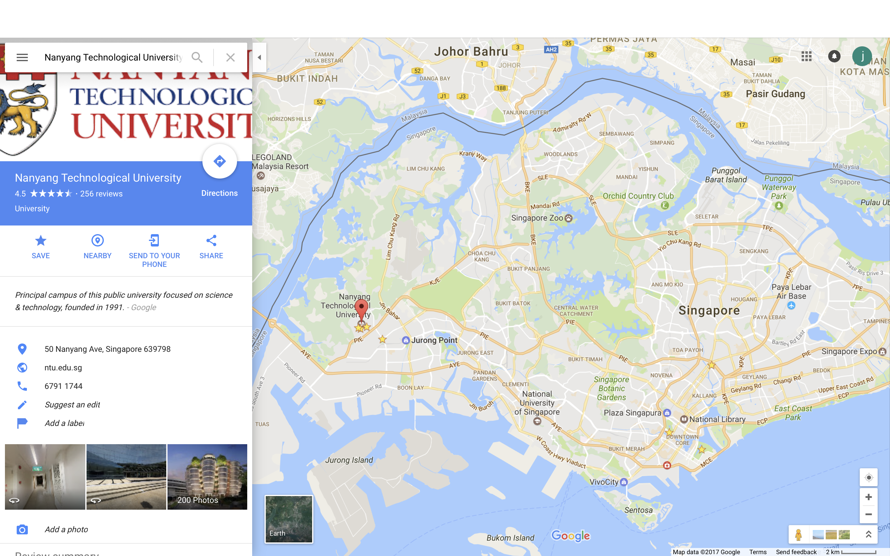

# 新加坡游玩攻略 `by XJD`

>此攻略按时间序列整理，流水记录形式，不以衣食住行作为分类，可以边读边玩
>此攻略实践时间为2017年2月份上中旬

## 第一天
* 环球影城(Universal Studios Singapore)

## 第二天
1. 鱼尾狮公园(Merlion Park) 

2. 新加坡海滨公园(Gardens By The Bay)

3. 午餐或者晚餐 - 肉骨茶 - 克拉克码头

## 第三天
* 新加坡动物园(Singapore Zoo)

## 第四天
* 新加坡植物园(Singapore Botanic Gardens)

## 第五天
1. 裕廊飞禽公园(Jurong Bird Park)

2. 南洋理工大学(Nanyang Technological University)

