## CSS Secrets Notes

> *What is CSS ?*
>
> CSS 全称 Cascading Style Sheet

### Introduction
* Vendor prefixes were an epic failure.

* Minimize code duplication

* 单位用em，随font-size动态变化。

* 半透明效果用 hsla 方法

* 响应式设计 (Responsive Web Design)

* 减少 “media” 指令的使用：
    1. 使用百分比宽度而不是固定宽度, 如果一定要固定宽度，尽量使用 vw, wh, vmax, vmin 这些 viewport-relative units。
    2. 当你想让某个元素变大时，使用 max-width, 而不是 width。
    3. 不要忘了给那些可置换元素设置max-width属性为100%。比如：img, object, video, iframe。
    4. 当背景图需要覆盖整个容器时，用 background-size: cover。最好不要把大图小化当移动终端的背景，浪费流量。
    5. When laying out images (or other elements) in a grid of rows and columns, let the number of columns be dictated by the viewport width. Flexible Box Layout (a.k.a. Flexbox) or display: inline-block and regular text wrapping can help with that.
    6. 当用多栏文本时，用 column-width 而不是 column-count，从而你在低分辨率的屏幕上能单栏显示。

* 在考虑响应式之前，你应该更多的保证你的设计足够的 “liquid”, 即别设计得太死板，如果所有参数都钉死了，就是太 “solid” 了。

### Backgrounds & Borders

1. Translucent Borders

    > **What is RGBA & HSLA ?**
    >
    > RGBA 实际上是 RGB + A，其中RGB代表由红、绿、蓝组成的颜色空间，A代表不透明度。
    > HSLA 实际上是 HSL + A，其中HSL是工业界的颜色标准，由H-色相，S-饱和度，L-明度组成，A代表不透明度。
    
    
    * _The Problem_ : 当我们设置以下样式时，并不能得到半透明的边框。
        
        border: 10px solid hsla(0, 0%, 100%, 0.5);
        background: white;
    
    * _The Solution_ : 得不到半透明的边框并不是上面的样式出问题了，而是背景并没有延伸到边框下来，浏览器背景默认渲染到 border edge, 而我们需要渲染到 padding edge, 所以以下样式会起作用。
    
        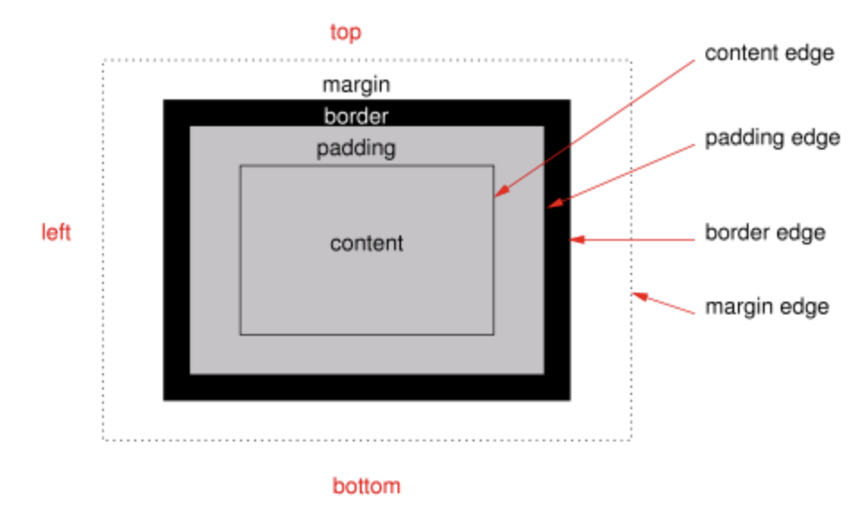
        
        _(图片来源: [dabblet.com](dabblet.com))_

            border: 10px solid hsla(0, 0%, 100%, 0.5);
            background: white;
            background-clip: padding-box;

2. Multiple Borders

    > **How to use Box-Shadow ?**
    >
    > `box-shadow: h-shadow, v-shadow, [blur, spread, color, inset]`
    >
    > 其中，带方括号的为可选参数，h-shadow 表示阴影水平平移, v-shadow 表示阴影垂直平移, blur 表示模糊半径, spread 表示阴影半径, color 表示阴影颜色, inset 表示阴影方向为内敛( outset 为向外发散，互斥)

    * _The Problem_ : 当我们需要多重边框时，我们需要用多于的元素来嵌套实现，这种实现方式十分丑陋。

    * _The Solution_ : 
        
        * 使用 box-shadow 来解决:
            
            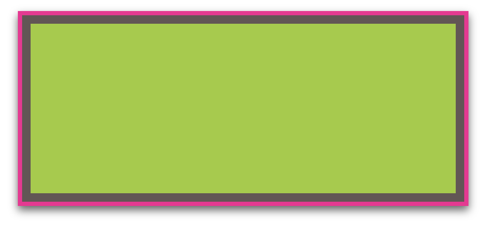
    
            _(图片来源: [dabblet.com](dabblet.com))_
    
                background: yellowgreen;
                box-shadow: 0 0 0 10px #655,
                            0 0 0 15px deeppink,
                            0 5px 10px 15px rgba(0,0,0,.6);

            * 因为这个方法只是模拟边框的视觉效果，所以实际使用是它所占的空间并不会被真正的去计算，不能和真正的border等同，需要利用 padding 或者 margin 来调整大小以和全局协调。

        * 使用 outline 来解决: 

            
    
            _(图片来源: [dabblet.com](dabblet.com))_

                    background: yellowgreen;
	                border: 10px solid #655;
	                outline: 15px solid deeppink;
	                border-radius:10px

            * 利用 outline 方法只能得到二重边框，无法得到多重边框，同时可以看到，border-radius 没有影响到 outline 的表达，这是一个bug。

* Flexsible Backgroud Position

    > How to use background-position ?
    >
    > `background-position: bottom right`, 这将会把背景放到容器右下角。

    * _The Problem_ : 如何让背景图偏离边界一点？

    * _The Solution_ :

        * 使用CSS3扩展的background-postion语法解决:

                background: url(code-pirate.svg) no-repeat #58a;
                background-position: right 20px bottom 10px;

        * 使用 background-origin 语法解决: 这种方法能省去每次调节 padding 大小的时候都要去调节 offset 的麻烦

                padding: 10px;
                background: url("code-pirate.svg") no-repeat #58a 
                            bottom right; /* or 100% 100% */
                background-origin: content-box; 

        * 使用 calc() 方法: 这种方法是始终以左上角为参照，利用 calc() 方法动态计算偏移值，注意+,-前后都必须有空格。 
                
                background: url("code-pirate.svg") no-repeat;
                background-position: calc(100% - 20px) calc(100%-10px);

* Inner Rounding

    * _The Problem_ : 如何让容器边框实现内圆外方的效果 ？

    * _The Solution_ : 

        * 使用两次嵌套的方法可以实现这种效果。

        * 使用 box-shadow + outline 解决:

            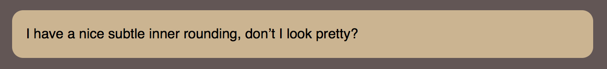
            
            _(图片来源: [dabblet.com](dabblet.com))_

                background: tan;
                border-radius: .8em;
                padding: 1em;
                box-shadow: 0 0 0 .6em #655;
                outline: .6em solid #655;

* Striped Backgrounds

    > What is CSS linear gradients ?
    >
    > 是一种CSS中实现颜色渐变的方法。

    * _The Problem_ : 用 CSS 原生语言来解决条纹背景的问题。

    * _The Solution_ : 用 linear-gradients 方法实现条纹背景

        * 产生横向条纹,如果需要铺满整个屏幕，将最后一句去掉即可。参数后的百分比表示，过渡点，如果两个值相同则没有过渡颜色。可以有不止两个过渡点，如果过渡点值为0，则和前一个过渡点的值保持一致
            
            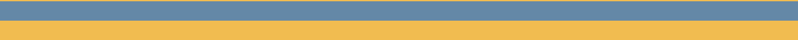
            
            _(图片来源: [dabblet.com](dabblet.com))_
                
                background: linear-gradient(#fb3 50%, #58a 50%);
                background-size: 100% 30px;
                background-repeat: no-repeat;

        * 产生竖直条纹

            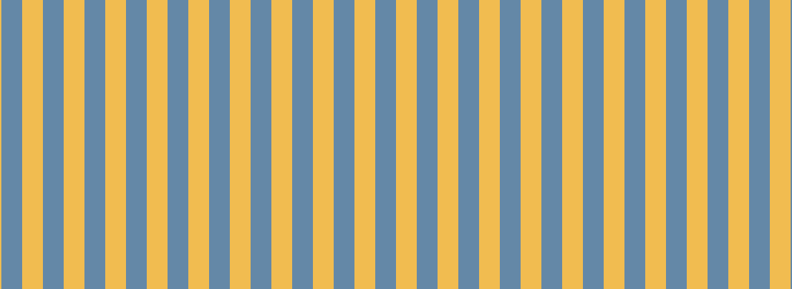
    
            _(图片来源: [dabblet.com](dabblet.com))_

                background: linear-gradient(90deg, #fb3 50%, #58a 0);
                background-size: 30px 100%;

        * 产生倾斜条纹

            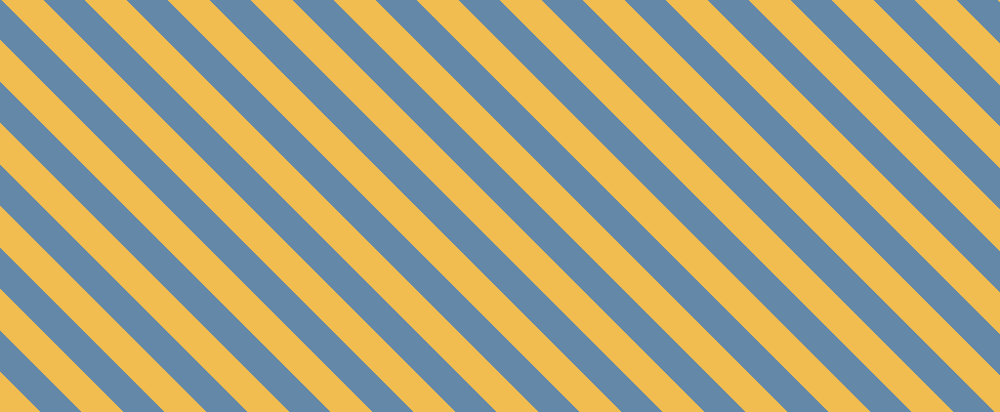
            
            _(图片来源: [dabblet.com](dabblet.com))_
                
                /*一种比较死板的实现方式，不灵活*/
                background: linear-gradient(45deg,
                                #fb3 25%, #58a 0, #58a 50%,
                                #fb3 0, #fb3 75%, #58a 0);
                background-size: 30px 30px;

                /*一种比较好的实现方式, 灵活且不受度数变化造成画面破碎的影响*/
                background: repeating-linear-gradient(60deg,
                                #fb3, #fb3 15px, #58a 0, #58a 30px);

* Complex Background Patterns

    * _The Problem_ : Is it posible to create any kind of geometric pattern with CSS gradients ?

    * _The Solution_ : 
        
        * Tablecloth Pattern
        
            
            
            _(图片来源: [dabblet.com](dabblet.com))_

                background:         white;
                background-image:   linear-gradient(90deg, rgba(200,0,0,.5) 50%, transparent 0),
                                    linear-gradient(rgba(200,0,0,.5) 50%, transparent 0);
                background-size:    30px 30px;

        * Grid Pattern

            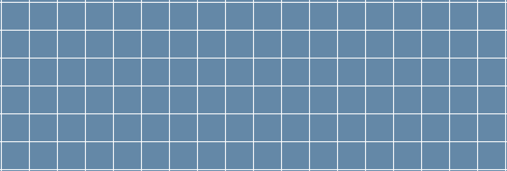
            
            _(图片来源: [dabblet.com](dabblet.com))_
            
                background: #58a;
                background-image:
                    linear-gradient(white 1px, transparent 0),
                    linear-gradient(90deg, white 1px, transparent 0);
                background-size: 30px 30px;

        * Complex Grid Pattern

            > background-size 用法
            >
            > background-size: length|percentage|cover|contain;
            >
            > 其中 `length` 可以有两个参数，第一个参数为长度，第二个为宽度，如果只设置一个，则第二个为 auto。
            > `percentage` 可以有两个参数，第一个参数为长度百分比，第二个为宽度百分比，如果只设置一个，则第二个为 auto。
            > `cover` 表示背景完全覆盖, 即拉伸效果。`contain` 表示适应内容区域, 将背景扩大到适应长宽的最大尺寸(图片不会变形), 平铺效果。
            
            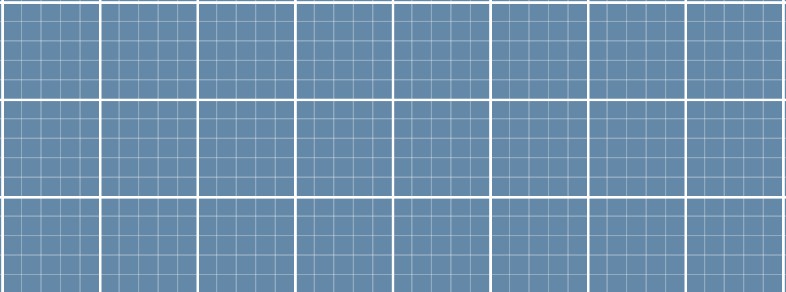
            
            _(图片来源: [dabblet.com](dabblet.com))_
    
                background: #58a;
                background-image:
                    linear-gradient(white 2px, transparent 0),
                    linear-gradient(90deg, white 2px, transparent 0),
                    linear-gradient(hsla(0,0%,100%,.3) 1px,transparent 0),
                    linear-gradient(90deg, hsla(0,0%,100%,.3) 1px, transparent 0);
                background-size:    75px 75px, 
                                    75px 75px,
                                    15px 15px, 
                                    15px 15px;

        * Polka Dot

            > radial-gradient 用法
            > 
            > background: radial-gradient(shape size postion, start-color, ..., last-color);
            >
            > 其中`shape` 为形状，默认为椭圆。`size` 默认为 farthest-corner，`position` 默认为 center。

            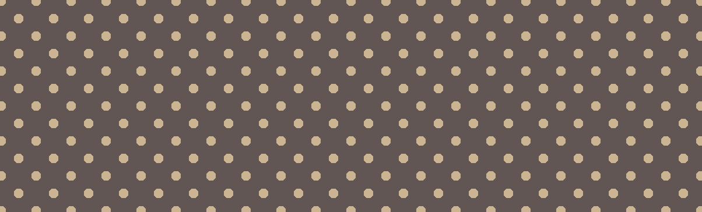
            
            _(图片来源: [dabblet.com](dabblet.com))_

                background: #655;
                background-image:   radial-gradient(tan 30%, transparent 0),
                                    radial-gradient(tan 30%, transparent 0);
                background-size: 30px 30px;
                background-position: 0 0, 
                                    15px 15px;

        * Checkboards

            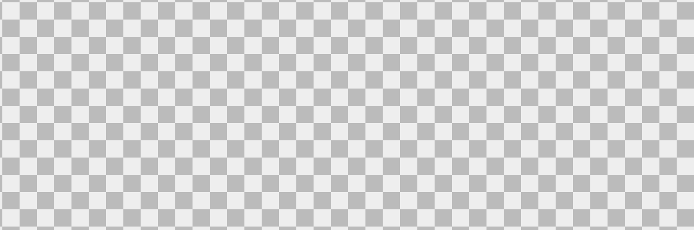
            
            _(图片来源: [dabblet.com](dabblet.com))_

                background: #eee;
                background-image:   linear-gradient(45deg, #bbb 25%, transparent 0),
                                    linear-gradient(45deg, transparent 75%, #bbb 0),
                                    linear-gradient(45deg, #bbb 25%, transparent 0),
                                    linear-gradient(45deg, transparent 75%, #bbb 0);
                background-position: 0 0, 15px 15px,
                                    15px 15px, 30px 30px;
                background-size: 30px 30px;

* Pseudo Random Backgrounds

    * _The Problem_ : 如何利用原生CSS给背景创造足够的随机性？

    * _The Solution_ : 利用所谓的 "Cicada Priciple", 即利用素数来当偏移值，当素数足够大时，重复周期也会变得非常大，即所谓的伪随机。

        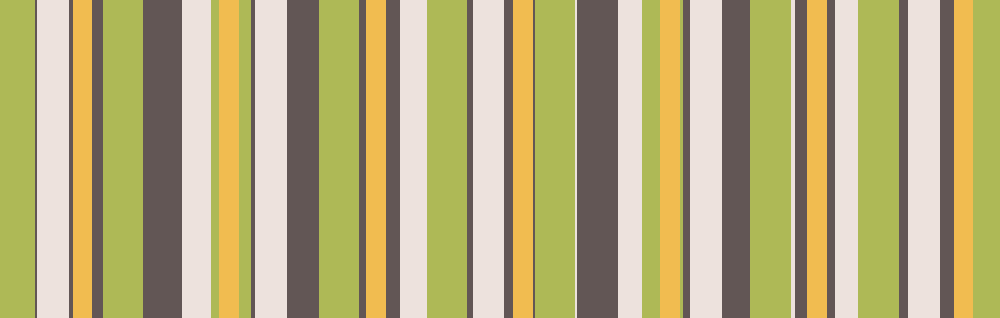
        
        _(图片来源: [dabblet.com](dabblet.com))_

            background: hsl(20, 40%, 90%);
            background-image:   linear-gradient(90deg, #fb3 11px, transparent 0),
                                linear-gradient(90deg, #ab4 23px, transparent 0),
                                linear-gradient(90deg, #655 41px, transparent 0);
            background-size: 41px 100%, 61px 100%, 83px 100%;

* Continuous Image Border
    
    * _The Problem_ : 如何在用图片做边框的时候让边框连续，border-image 的方法实际上是把图片切片后再做边框的，并不连续。有一种笨办法是利用两个容器嵌套，大的当背景伪造出连续边框的效果。

    * _The Solution_ : 利用 CSS3 新增语法实现在一个 element 中的连续图像边框。整体思路为把图像当背景，把图像覆盖到 border-box, 然后伪造一个白色背景覆盖 padding-box，即可得到。
                        由于 background-color 实现的背景只能在最后一层，所以只能有线性渐变的方法伪造白色背景。在 background 语句中最后的 0 / cover 代表将图片置于底层并采用拉伸效果。

        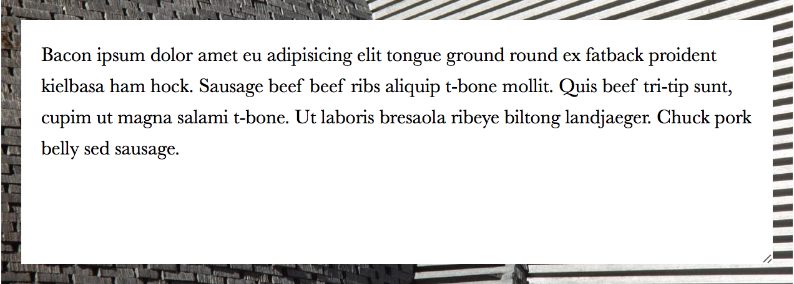
        
        _(图片来源: [dabblet.com](dabblet.com))_

            padding: 1em;
            border: 1em solid transparent;
            background: linear-gradient(white, white) padding-box,
                        url(stone-art.jpg) border-box 0 / cover;

### Shapes

* Flexible Ellipses

    * _The Problem_ : 如何优雅的实现椭圆形 ？

    * _The Solution_ : 
        
        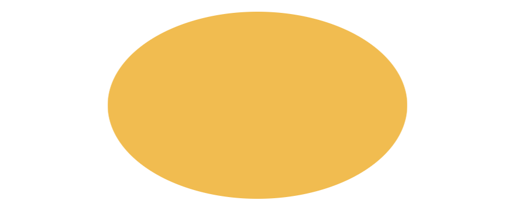
    
        _(图片来源: [dabblet.com](dabblet.com))_

            border-radius: 50% / 50%;

* Parallelograms

    > What is transform ?
    >
    > 用法，transform: none|transform-functions;
    >
    > 其中 transform-functions 包含倾斜、旋转、缩放等函数，具体可以查文档。

    * _The Problem_ : 如何优雅的实现容器的平行四边形 ？

    * _The Solution_ : 利用 transform 方法能让容器平行四边形，同时也将会拉扯其内容，比如文字，变得巨丑无比，所以需要在里面一层再次使用transform 拉扯回来。
                        同时，也可以利用伪元素来伪造一个平行四边形，从而不影响本体。

            .button {
                position: relative;
                /* text color, paddings, etc. */
            }
            .button::before {
                content: ''; /* To generate the box */
                position: absolute;
                top: 0; right: 0; bottom: 0; left: 0;
                z-index: -1;
                background: #58a;
                transform: skew(45deg);
            }

* Diamond Images

    > What is clip-path ?
    >
    > 一个从 SVG 借鉴过来的特性, 根据一连串定义的点来裁剪容器从而形成多边形。

    * _The Problem_ : 如何优雅的实现菱形容器？

        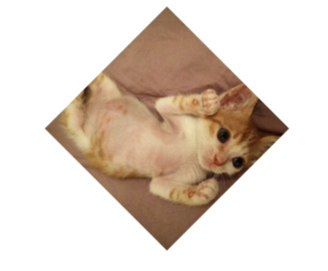
        
        _(图片来源: [dabblet.com](dabblet.com))_

    * _The Solution_ :
        * 传统方法 :
    
                .picture {
                    width: 400px;
                    transform: rotate(45deg);
                    overflow: hidden;
                }
                .picture > img {
                    max-width: 100%;
                    transform: rotate(-45deg) scale(1.42);
                }

        * 利用 clip-path。(Warning! 不是所有浏览器都支持这个属性)
                    
                /* 实际上，方法的4组参数定义了四个点，这四个点由父容器尺寸的百分比表示*/
                clip-path: polygon(50% 0, 100% 50%, 50% 100%, 0 50%);

* Cutout Corners

    * _The Problem_ : 如何实现边角裁剪 ？

    * _The Solution_ : 
        * 任然是利用线性渐变。(我感觉所谓线性渐变实际上是生成了一个图，然后贴上去)
       
        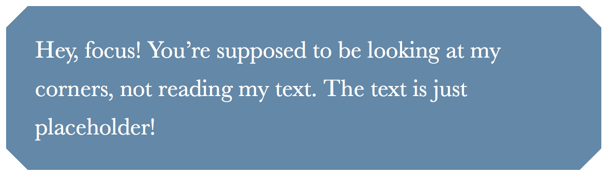

        _(图片来源: [dabblet.com](dabblet.com))_

        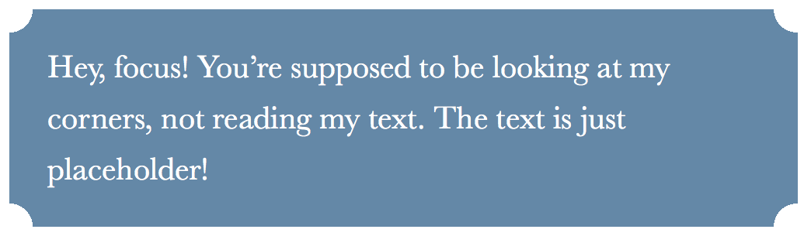
        
        _(图片来源: [dabblet.com](dabblet.com))_
            
            /* Cutout Corner */
            background: #58a;
            background: linear-gradient(135deg, transparent 15px, #58a 0) top left,
                        linear-gradient(-135deg, transparent 15px, #655 0) top right,
                        linear-gradient(-45deg, transparent 15px, #58a 0) bottom right,
                        linear-gradient(45deg, transparent 15px, #655 0) bottom left;
            background-size: 50% 50%;
            background-repeat: no-repeat;

            /* Curved Cutout Corner */
            background: #58a;
            background:
            radial-gradient(circle at top left, transparent 15px, #58a 0) top left,
            radial-gradient(circle at top right, transparent 15px, #58a 0) top right,
            radial-gradient(circle at bottom right, transparent 15px, #58a 0) bottom right,
            radial-gradient(circle at bottom left, transparent 15px, #58a 0) bottom left;
            background-size: 50% 50%;
            background-repeat: no-repeat;

        * 利用 border-image 

            background: #58a;
            clip-path: polygon(
                        20px 0, calc(100% - 20px) 0, 100% 20px,
                        100% calc(100% - 20px), calc(100% - 20px) 100%,
                        20px 100%, 0 calc(100% - 20px), 0 20px
                        );

* Trapezoid Tabs

    * _The Problem_ : 如何创建广义的四边形 (比如梯形等等) ？

    * _The Solution_ : 
        * Through 3D rotation，再一次用到了伪元素，当使用 rotate 的时候，利用 transform-origin 固定一边，使得整个元素
            的行为更加好管理 (比如固定底边，当使用 rotateX 时，高度变化而底边固定)，为了更好的“容”下内容，需要 scale 适当的倍数。
            perspective 表示3D 元素距离视图的距离，这个属性浏览器支持不理想。

            nav > a {
                position: relative;
                display: inline-block;
                padding: .3em 1em 0;
            }
            
            nav > a::before {
                content: '';
                position: absolute;
                top: 0; right: 0; bottom: 0; left: 0;
                z-index: -1;
                background: #ccc;
                background-image: linear-gradient(
                                    hsla(0,0%,100%,.6),
                                    hsla(0,0%,100%,0));
                border: 1px solid rgba(0,0,0,.4);
                border-bottom: none;
                border-radius: .5em .5em 0 0;
                box-shadow: 0 .15em white inset;
                transform: perspective(.5em) rotateX(5deg);
                transform-origin: bottom;
            }
 

* Simple Pie Charts

    * _The Problem_ : 实现饼状图效果。

    * _The Solution_ :
        * Transform-based solution : 
        
            .pie {
                width: 100px; height: 100px;
                border-radius: 50%;
                background: yellowgreen;
            }
            background-image : linear-gradient(to right, transparent 50%, #655 0);

            .pie::before {
                content: '';
                display: block;
                margin-left: 50%;
                height: 100%;
                border-radius: 0 100% 100% 0 / 50%;
                background-color: inherit;
                transform-origin: left;
                animation: spin 3s linear infinite,
                           bg 6s step-end infinite;
            }

### Intrinsic Sizing

    * _The Problem_ : 图片居中

    * _The Solution_ : 实际上关键在于 `margin:auto` 这一句，这会让其自动调节左右margin。

        figure {
            max-width: 300px;
            max-width: min-content;
            margin: auto;
        }
        
        figure > img { max-width: inherit; }
