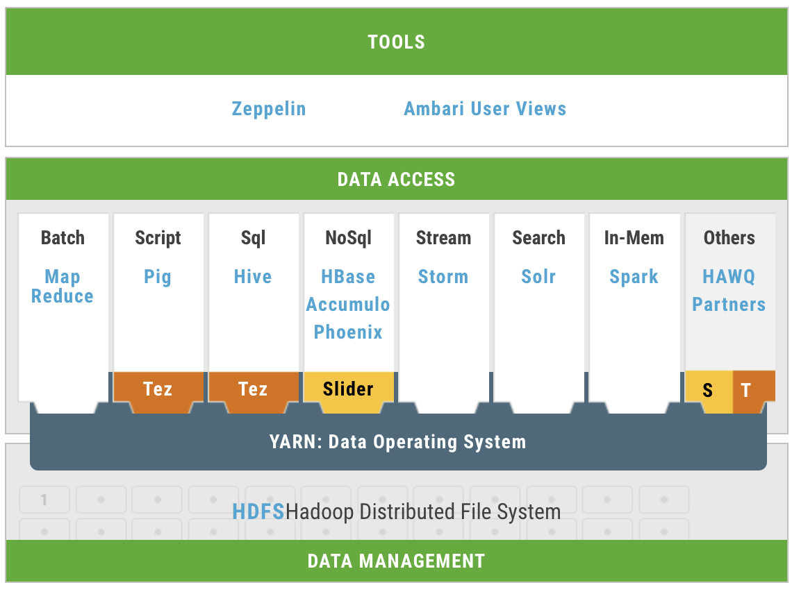
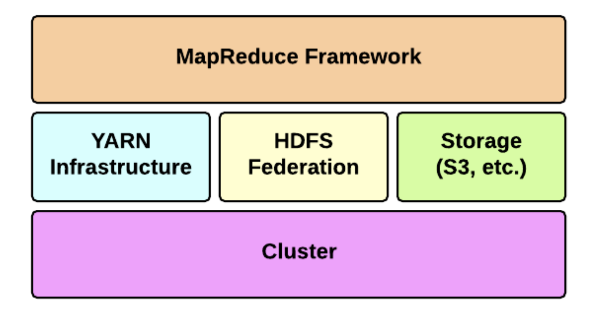
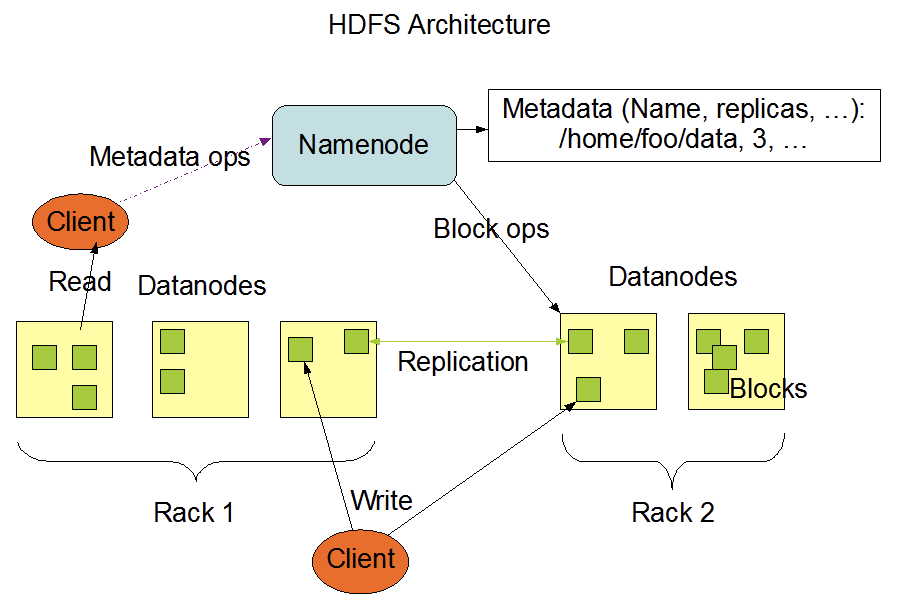
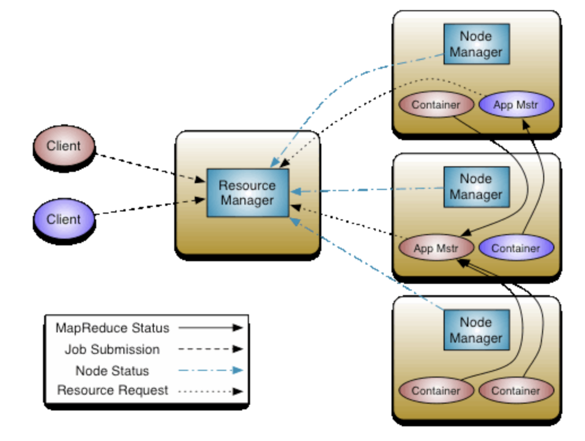
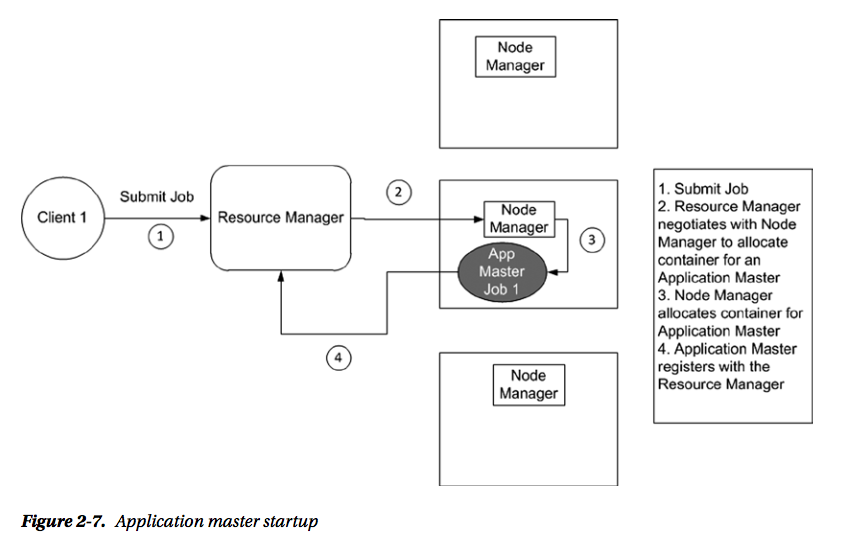
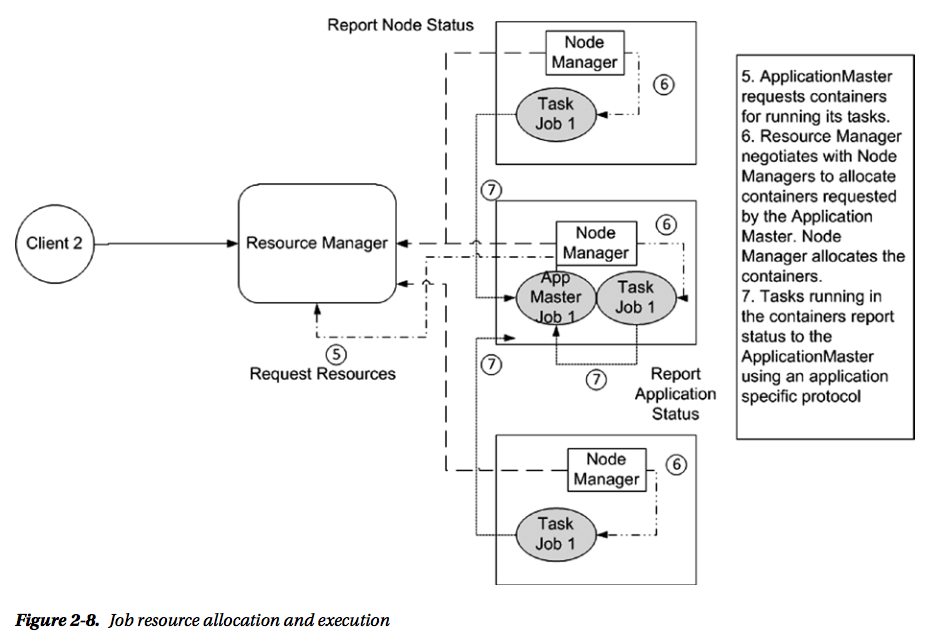
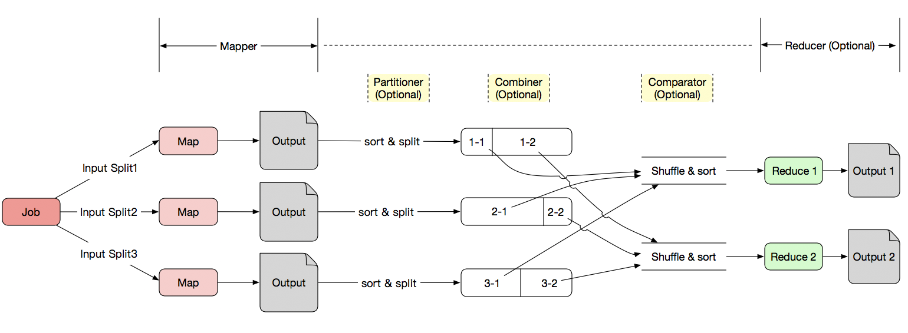

## Hadoop Startup

> **What is Apache Hadoop ?**
>
> Hadoop 是一个为大数据在集群环境下并行处理所设计的软件框架，它提供了一套简单的编程模型给用户实现具体应用。Hadoop 的设计目的是将数据处理从单一的服务器扩展到成千上万的服务器，每个服务器提供其计算和存储资源。Hadoop 的设计在软件层面充分考虑了高可用性，使得其高可用性不再依赖于硬件设备，(将服务器失效看成一种正常状态)。
>
> **Hadoop 是 Google 的集群系统的开源实现 (主要基于`三篇论文`)**
>
> 1. Ghemawat, Sanjay, Howard Gobioff, and Shun-Tak Leung. "The Google file system." ACM SIGOPS operating systems review. Vol. 37. No. 5. ACM, 2003.
> 2. Guo, C., et al. "MapReduce: Simplified Data Processing on Large Clusters." Proc. of OSDI 2004, San Francisco, CA, USA (2004).
> 3. Ghemawat, Sanjay, et al. "Bigtable: A Distributed Storage System for Structured Data." OSDI, 2006.
> 
>Hadoop `主模块`
>
> * _Hadoop Common_ : 一个用来支持 Hadoop 其他模块的通用工具模块。
> * _Hadoop Dstributed File System_ : 一个用来为应用数据提供高吞吐I/O的分布式文件系统。
> * _Hadoop YARN_ : 一个用来进行任务调度和集群资源管理的框架。
> * _Hadoop MapReduce_ : 一个基于 YARN 的大数据并行处理系统。
>
>Hadoop `相关子项目`

> * Ambari : 一个基于网页的综合管理工具。可以对包括 Hadoop HDFS，Hadoop MapReduce，Hive，HCatalog，HBase，ZooKeeper，Oozie，Pig，Sqoop进行管理和监视。
> * Avro : 一个数据序列化系统。
> * Cassandra : 一个可扩展，防单点故障的多主数据库。
> * Chukwa : 一个用来管理分布式系统的数据收集系统。
> * HBase : 一个用来支持机构化数据的大表的可扩展，分布式的数据库。
> * Hive : 一个可以提供 data summarization 和 ad hoc querying 的数据仓库基础设施。
> * `Mahout` : 一个可扩展的机器学习和数据挖掘库。
> * Pig : 一个高层次的并行计算数据流语言和执行框架。
> * `Spark` : 一个为海量数据设计的高速且通用的计算引擎，它提供一种简单和易于理解的编程模型来支持一系列的应用，包括ETL，机器学习，流数据处理，图计算等。
> * Tez : 一个通用的数据流编程框架。
> * ZooKeeper : 提供高性能分布式应用协调服务。
>
>  
>
>  _(图片来源: [Hortonworks](https://hortonworks.com/products/data-center/hdp/))_

### 准备工作
* Hardware
* Software
    1. 操作系统
        * Ubuntu 16.04 LTS

    2. Hadoop 用户, 避免使用root用户

            $ sudo adduser hadoop 
            $ sudo adduser hadoop sudo

    3. Hadoop 版本
        * Hadoop 2.7.3

    4. 环境
        * Java (建议不要装openjdk1.9)

                $ sudo apt-get install openjdk-8-jdk

        * SSH

                $ sudo apt-get install ssh

        * vim (Optional)

                $ sudo apt-get install vim

    5. 安装步骤
        * 切换到 hadoop 用户, 并切换到主目录下

                $ su hadoop
                $ cd ~

        * 下载 hadoop 2.7.3

                $ wget http://www-eu.apache.org/dist/hadoop/common/hadoop-2.7.3/hadoop-2.7.3.tar.gz

        * 解压, 解压后文件默认放在主目录下

                $ tar -zxvf hadoop-2.7.3.tar.gz

        * 配置系统,网络环境

            1. 配置bash环境

                    $ gedit ~/.bashrc
                    #添加以下三行到文件末尾
                    export JAVA_HOME=/usr/lib/jvm/java-1.8.0-openjdk-amd64
                    export HADOOP_HOME=/home/hadoop/hadoop-2.7.3
                    export PATH=$PATH:$JAVA_HOME/bin:$HADOOP_HOME/bin

            2. 配置master网络环境,修改hostname,并重启终端。

                    $ sudo vim /etc/hostname
                    #修改内容为以下名字,每个机器不同,名字可以自己定义，千万不要有下划线。
                    master

                    #配置hosts文件
                    $ sudo vim /etc/hosts
                    #按以下格式添加到文件末尾
                    IPv4    hostname1
                    IPv4    hostname2
                    ···     ···
                
            3. 配置免密码登录

                    #在每台机器下执行rsa生成指令, 后续输入直接回车跳过直至结束。
                    $ ssh-keygen -t rsa

                    #在每台机器下创建authorized_keys文件
                    $ touch ~/.ssh/authorized_keys

                    #将自己(master)的公钥添加到认证文件中
                    $ cat ~/.ssh/id_rsa.pub >> ~/.ssh/authorized_keys

                    #将各个机器的公钥发送给master
                    $ scp ~/.ssh/id_rsa.pub hadoop@hostname:~/.ssh/hostname_rsa.pub

                    #将其他(除master)外的公钥全部添加到认证文件中
                    $ cat ~/.ssh/hostname_rsa.pub >> ~/.ssh/authorized_keys

                    #将master的认证文件传给其他节点 (此时，master的认证文件包含所有节点公钥)
                    $ scp ~/.ssh/authorized_keys hadoop@hostname:~/.ssh/authorized_keys

        * 配置hadoop内部环境。

                $ gedit ~/hadoop-2.7.3/etc/hadoop/hadoop-env.sh
                #添加以下2行到文件末尾
                export JAVA_HOME=/usr/lib/jvm/java-1.8.0-openjdk-amd64
                export HADOOP_PREFIX=/home/hadoop/hadoop-2.7.3

        * 配置hadoop配置文件

            1. ~/hadoop-2.7.3/etc/hadoop/core-site.xml

                    #添加以下内容
                    <configuration>
                        <property>  
                            <name>fs.defaultFS </name>
                        <value>hdfs://master:9000</value> 
                        </property>
                        <property>
                            <name>hadoop.tmp. dir</name>
                            <value>file :/home/hadoop/hadoop-2.7.3/tmp</value>
                        </property>
                    </configuration>

            2. ~/hadoop-2.7.3/etc/hadoop/hdfs-site.xml

                    #添加以下内容，replication为副本数量
                    <configuration>
                        <property>
                            <name>dfs.namenode.secondary.http−address</name> 
                            <value>master:50090</value>
                        </property> 
                        <property>
                            <name>dfs.replication</name>
                            <value>2</value> 
                        </property>
                        <property>
                            <name>dfs.namenode.name.dir</name>
                            <value>file:/home/hadoop/hadoop-2.7.3/tmp/dfs/name</value>
                        </property>
                         <property>
                            <name>dfs.datanode.data.dir </name>
                            <value>file:/home/hadoop/hadoop-2.7.3/tmp/dfs/data</value>
                         </property>
                    </configuration>

            3. ~/hadoop-2.7.3/etc/hadoop/mapred-site.xml

                    #默认没有此文件，先创建一个
                    $ cp mapred-site.xml.template mapred-site.xml

                    #添加以下内容
                    <configuration>
                        <property>
                            <name>mapreduce.framework.name</name> 
                            <value>yarn</value>
                        </property> 
                        <property>
                            <name>mapreduce.jobhistory.address</name>
                            <value>master:10020</value> 
                        </property>
                        <property>
                            <name>mapreduce.jobhistory.webapp.address</name>
                            <value>master:19888</value>
                        </property> 
                    </configuration>

            4. ~/hadoop-2.7.3/etc/hadoop/yarn-site.xml
                
                    #添加以下内容
                    <configuration>
                        <property>
                            <name>yarn.resourcemanager.hostname</name> 
                            <value>master</value>
                        </property> 
                        <property>
                            <name>yarn.nodemanager.aux−services</name>
                            <value>mapreduce_shuffle</value> 
                        </property>
                        <property>
                            <name>mapreduce.jobhistory.webapp.address</name>
                            <value>master:19888</value>
                        </property> 
                    </configuration>

        * 将hadoop传输至各个节点

                #压缩master的hadoop目录
                $ tar -zcvf ~/hadoop-2.7.3.tar.gz ~/haddop-2.7.3

                #传输至各个节点
                $ scp ~/hadoop-2.7.3.tar.gz hadoop@hostname:~/

                #在各个节点中解压即可
                $ tar -zxvf ~/hadoop-2.7.3.tar.gz

        * 启动

                #进入到master中~/hadoop-2.7.3/sbin/目录下
                $ cd ~/hadoop-2.7.3/sbin/

                #启动hdfs
                $ ./start-dfs.sh

                #启动yarn
                $ ./start-yarn.sh

### 架构概览

0. Hadoop Basical Architecture

    

    _(图片来源:[http://ercoppa.github.io/HadoopInternals/HadoopArchitectureOverview.html](http://ercoppa.github.io/HadoopInternals/HadoopArchitectureOverview.html))_

1. HDFS

    

    _(图片来源:[http://hadoop.apache.org/](http://hadoop.apache.org/))_

    * `Namenode` 属于管理节点 (Master)，主要功能为接受客户端 (Client) 读写命令, Namenode会保存文件的元信息，这些元信息包括：文件所属、权限、包含哪些块、这些块保存在哪个Datanode (由Datanode启动时上报)。 Namenode的元信息在启动后会加载到内存。Namenode中对元数据的动态操作会单独记录在另一个文件，磁盘文件不会实时更新，这个操作会由 SecondaryNamenode 执行，但是内存中的数据会实时更新。
    * `SecondaryNamenode` 是一个辅助 Namenode 的管理节点。主要帮助 Namenode 中动态操作的与原元数据的合并操作。然后把合并完的数据替换在 Namenode 中的原元数据 (即更新metadata)。
    * `Datanode` 是实际存储数据 (Block) 的节点 (Slave)，启动 Datanode 时会向 Namenode 发送 Block 的信息。Datanode 每3秒发送一次心跳包，如果 Namenode 10分钟没有接受到 Datanode 的心跳包，则 Namenode 认为这个 Datanode 已经失效，并将其上的遗失的副本放置到其他 Datanode 中。
    * `Block` 副本放置策略
        * 第一个副本：如果上传文件的机器是一个 Datanode，则直接放在本地, 否则在本集群中选择一个合适的 Datanode。
        * 第二个副本：放置在于第一个副本不同机架的节点上。
        * 第三个副本：放置在于第二个副本相同的机架上 (数据传的快)。
        * 更多副本：随机节点。

2. YARN - Yet Another Resource Negotiator

    

    _(图片来源:[http://hadoop.apache.org/](http://hadoop.apache.org/))_

    * `Container` : Container 可以看做 YARN 框架下的一个计算单位，它包含两类系统资源，一个是CPU资源，一个是内存资源，一个机器可以拥有多个 Container，一个 Container 仅包含在一个机器中。大部分的 Job(s) 会在多个 Container 中运行。
    * `ResourceManager` (Master) : 统筹管理系统中所有应用资源的权威系统。具体 Task 的创建、准备、监控资源的任务委派给了 NodeManager。ResourceManager 包括两个主要部件：Scheduler 和 ApplicationsManager 。
        * _Scheduler_ : 负责分配资源给各种需要运行的程序 (考虑容量、队列等条件)。
        * _ApplicationsManager_ : 负责接收 Job 提交，协商需要执行特定 ApplicationMaster 的 Container，并对其提供失效支持 (provide the service for restarting the ApplicationMaster container on failure)。
    * `NodeManager` (Slave) : 负责管理机器上的 containers (每个NodeManager管理自己机器的 containers)，监视它们的使用情况，包括 cpu, memory, disk, network 的状态，并将这些信息上报给 ResourceManager。和 ResourceManager 一起管理和分配集群上的资源。ResourceManager 是一个全局的部件，而 NodeManager 是每个机器上的代理负责管理本地机器的运行。
    * **`ApplicationMaster`** : Hadoop 2.x 中非常重要的一个概念，这是2.x和1.x关键的一个不同的地方，它负责向 ResourceManager 协商 Containers 资源。
    * _ApplicationMaster_ Startup :

        

        _(图片来源: Pro Apache Hadoop)_

    * _Job Resource Allocation and Execution_ : 

        
        
        _(图片来源: Pro Apache Hadoop)_
        
3. MapReduce (计算框架)

    

    * Mapper 阶段
        * `Map` : 将输入文件处理映射为键值对形式，输入和输出的格式不要求一样。Map 任务的个数由输入文件的 Block 个数决定。

    * Reducer 阶段
        * `Reduce` : 合并键相同的键值对。Reduce 的数量可由用户定义，一般由下列公式产生

            $$ number\_of\_reduces = a \times (numer\_of\_nodes \times number\_of\_max_containers\_per\_node) \\ a = 0.95 \quad or \quad 1.75 $$

    * `Partitioner` : 对键空间进行划分。
    * `Counter` : 记录 MapReduce 过程中各种数据状态。

4. MapReduce Coding Demo - Word Count (官方Demo)
    * 搭建编程环境
        1. 安装eclipse

        2. 安装maven
                
                $ sudo apt-get install maven

        3. 创建maven项目, 在eclipse中创建 maven 项目。注意勾选 ‘Create a simple project’选项
        
        4. 配置项目依赖
        
                #添加以下内容到项目pom.xml文件中
                <dependencies>  
                    <dependency>  
                        <groupId>org.apache.hadoop</groupId>  
                        <artifactId>hadoop-common</artifactId>  
                        <version>2.7.3</version>  
                    </dependency>  
                    <dependency>  
                        <groupId>org.apache.hadoop</groupId>  
                        <artifactId>hadoop-hdfs</artifactId>  
                        <version>2.7.3</version>  
                    </dependency>  
                    <dependency>  
                        <groupId>org.apache.hadoop</groupId>  
                        <artifactId>hadoop-mapreduce-client-core</artifactId>  
                        <version>2.7.3</version>  
                    </dependency>  
                    <dependency>  
                        <groupId>org.apache.hadoop</groupId>  
                        <artifactId>hadoop-mapreduce-client-jobclient</artifactId>  
                        <version>2.7.3</version>  
                    </dependency>  
                    <dependency>  
                        <groupId>org.apache.hadoop</groupId>  
                        <artifactId>hadoop-mapreduce-client-common</artifactId>  
                        <version>2.7.3</version>  
                    </dependency> 
                    <dependency>  
                        <groupId>jdk.tools</groupId>  
                        <artifactId>jdk.tools</artifactId>  
                        <version>1.8</version> 
                        <scope>system</scope>  
                        <systemPath>${JAVA_HOME}/lib/tools.jar</systemPath>  
                    </dependency> 
                </dependencies>

                # (Optional) 如果项目 Maven Dependencies 下没有自动添加依赖，进入终端，切换到项目根目录
                $ cd your_project_directory/
                $ mvn clean install

        5. 添加hadoop配置文件到项目resources目录下，将配置好的core-site.xml, hdfs-site.xml, mapred-site.xml添加到 src/main/resources。

        6. 在 src/main/java 下新建类。按照官方Demo写好代码。

                # WordCount
                import java.io.IOException;
                import java.util.StringTokenizer;                
                import org.apache.hadoop.conf.Configuration;
                import org.apache.hadoop.fs.Path;
                import org.apache.hadoop.io.IntWritable;
                import org.apache.hadoop.io.Text;
                import org.apache.hadoop.mapreduce.Job;
                import org.apache.hadoop.mapreduce.Mapper;
                import org.apache.hadoop.mapreduce.Reducer;
                import org.apache.hadoop.mapreduce.lib.input.FileInputFormat;
                import org.apache.hadoop.mapreduce.lib.output.FileOutputFormat;
                
                public class WordCount {
                
                  public static class TokenizerMapper
                       extends Mapper<Object, Text, Text, IntWritable>{
                
                    private final static IntWritable one = new IntWritable(1);
                    private Text word = new Text();
                
                    public void map(Object key, Text value, Context context
                                    ) throws IOException, InterruptedException {
                      StringTokenizer itr = new StringTokenizer(value.toString());
                      while (itr.hasMoreTokens()) {
                        word.set(itr.nextToken());
                        context.write(word, one);
                      }
                    }
                  }
                
                  public static class IntSumReducer
                       extends Reducer<Text,IntWritable,Text,IntWritable> {
                    private IntWritable result = new IntWritable();
                
                    public void reduce(Text key, Iterable<IntWritable> values,
                                       Context context
                                       ) throws IOException, InterruptedException {
                      int sum = 0;
                      for (IntWritable val : values) {
                        sum += val.get();
                      }
                      result.set(sum);
                      context.write(key, result);
                    }
                  }
                
                  public static void main(String[] args) throws Exception {
                    Configuration conf = new Configuration();
                    Job job = Job.getInstance(conf, "word count");
                    job.setJarByClass(WordCount.class);
                    job.setMapperClass(TokenizerMapper.class);
                    job.setCombinerClass(IntSumReducer.class);
                    job.setReducerClass(IntSumReducer.class);
                    job.setOutputKeyClass(Text.class);
                    job.setOutputValueClass(IntWritable.class);
                    FileInputFormat.addInputPath(job, new Path(args[0]));
                    FileOutputFormat.setOutputPath(job, new Path(args[1]));
                    System.exit(job.waitForCompletion(true) ? 0 : 1);
                  }
                }
    
        7. 编译并打包成jar文件，eclipse 默认会自动编译，所以直接从 文件->导出 选择导出JAR 包，命名为主类名字即可(WordCount)

        8. 运行程序
                
                #打开集群，start-dfs.sh, start-yarn.sh
                #首先清除 hdfs 中已存在的output文件夹，每次运行程序都要清理。
                $ hdfs dfs -rm -r /user/hadoop/output

                #在 hdfs 上创建输入文件夹
                $ hdfs dfs -mkdir /user/hadoop/input
                
                #复制输入文件到 hdfs
                $ hdfs dfs -put ~/hadoop-2.7.3/etc/hadoop/*.xml /user/hadoop/input

                #运行程序
                $ hadoop jar WordCount.jar package_name.WordCount /user/hadoop/input /user/hadoop/output

                #运行完毕后，结果会保存到/user/hadoop/output下，
                #可以进入 master:50070 -> utilities -> Browse the file system 下输入上述路径下载查看输出。

### MapReduce不足 
* Hadoop 解决的问题: ***解决了大数据的可靠存储和处理的问题***
        
* MapReduce不足
    1. 抽象层次低，使用难以上手。
    2. 只提供两个操作，表达力欠缺。
    3. 中间结果放在HDFS中，拖慢整体速度。
    4. Reduce需要等待所有Map完成后才开始。
    5. 对于迭代数据处理性能差。

* Apache Pig 简化编程
    
    目前最新 releases 版本为 0.16.0 (June, 2016)。可以运行于Tez上 (Tez mode)  

* Apache Tez 工作流优化

    Tez 是一个应用框架，用来处理复杂DAG工作流, 需要YARN，HDFS支持。目前最新 releases 版本为 0.8.4 (June, 2016)

* Apache Spark - MapReduce 的继任者
    
    Spark介绍和与MapReduce的对比会在_Spark Startup_中详述。

---

> **References**
>
> * [Apache Hadoop 2.7.3 Documentations](http://hadoop.apache.org/docs/r2.7.3/index.html) : 官方文档。
> * [Ercoppa](http://ercoppa.github.io) : Github上一个学习Hadoop框架的项目 (不是很完整)
> * [_Pro Apache Hadoop_](#) : 主要介绍Hadoop1.x的书，同时也会介绍Hadoop2.x，1.x和2.x的架构不完全相同，注意版本。
> * [利用maven创建hadoop项目](http://blog.fens.me/hadoop-maven-eclipse/) : 利用自动化工具maven搭建hadoop1.0.3项目（太旧）。
> * [知乎回答 - hadoop零基础学习路线](https://www.zhihu.com/question/19795366) : 比较系统，但是有些资料比较老。
> * [知乎回答 - 与Hadoop对比，如何看待Spark技术](https://www.zhihu.com/question/26568496/answer/41608400) : 最高票答案。
