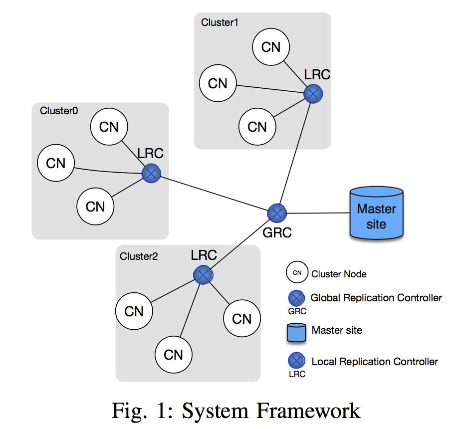
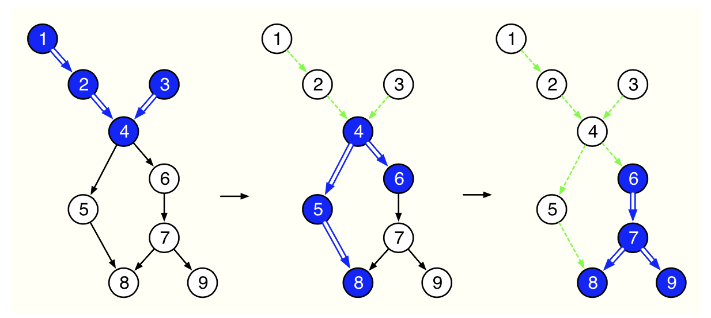

# **原方向**

## File selection and replica placement
>在一个星型网络中，中心节点存储所有文件的“原本”，其他节点向中心节点请求文件
>任务是设计一种算法，来预测文件热度，并将热度较高的文件的副本推送到离其他节点较近的
>资源节点上，从而减少网络延迟。

### 系统模型

### 已有改进
* 重新定义热度
* 设计了一种异步算法来预测并推送副本
* 初步试验验证

`进一步改进需要重新设计实验代码`

# **新方向**

## Clearing contamination in large networks
>Reference:Simpson M, Srinivasan V, Thomo A. `Clearing contamination in large networks`[J]. **`TKDE`**, 2016, 28(6): 1435-1448.

>在一个有向无环图中，设计一个算法生成一个策略(一系列步骤)来清理(遍历)图中所有边。难点在于以下限制条件：
> * 初始情况下假设所有边都被污染
> * 某个边的两个端点都有Searcher时，此边为清理完的边。但是当此边的某个端点的入射边为污染边时（并且无Searcher），此边又将被污染
> * 必须清理完所有边
> * 最小化搜索时间(Search Time),实际意思为最小化策略长度

* Example

 蓝色节点为有Searcher的节点， 蓝色边为当前轮清理的边，绿色边为之前清理的边，黑色边为污染边

### 想法
* 在FAS时给边权重，在去环优先去掉权大的边，这样在后面生成的策略中有天然优势
* 并行化？
* 原算法是改造于深度搜索算法，针对深搜的劣势改进

### 已完成工作
* 已完成FAS python代码撰写
* 基本完成原论文策略构建算法python代码撰写（基于深搜）