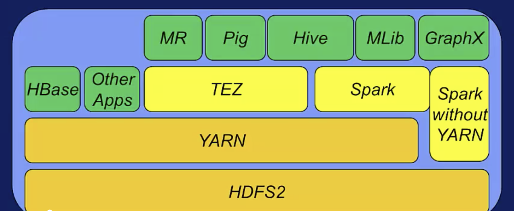

## Spark Startup

> *What is Spark ?*
>
> 一个高效且通用的计算海量数据的引擎，它为高级语言提供高层次的编程结构，包括Java，scala，python和R。
> Spark 拥有为通用图计算 (这里图计算指：execution graph, 类似指令流) 优化过的引擎。同时它还支持高层次的
> 工具，包括Spark SQL，MLlib (机器学习库)，GraphX (图处理), Spark Streaming (流处理)。
>
> *Spark in Hadoop*
>
> 
